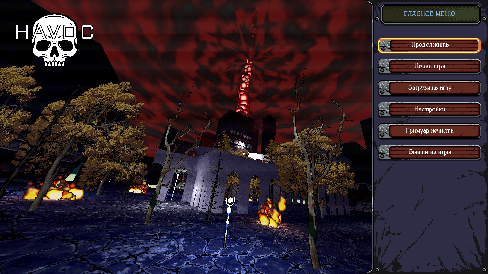

# Havoc

3D Шутер от первого лица в ретро-стилистике 90-х, разработанный на Java с использованием фреймворка LibGDX.

## 🎮 О проекте

Havoc — это 3D шутер, вдохновленный классическими играми 90-х годов. Проект сочетает в себе низкополигональную графику, пиксельные текстуры и динамичный геймплей в лучших традициях жанра, с добавлением современных игровых механик и технологий.

## ✨ Особенности

- **Ретро-стилистика**: Низкополигональная графика и пиксельные текстуры
- **Динамичный геймплей**: Быстрое перемещение и разнообразное оружие
- **Продвинутый ИИ**: Противники с интеллектуальным поведением на основе конечных автоматов
- **Система прокачки**: Улучшение характеристик персонажа между уровнями
- **Полная настройка**: Гибкие настройки управления, графики и звука
- **Надежные сохранения**: Шифрование данных сохранений (AES + HMAC)
- **Кроссплатформенность**: Поддержка PC, Android и веб-сборки

## 🖼️ Скриншоты

## 🛠️ Технологии

- **Язык программирования**: Java 17
- **Фреймворк**: LibGDX
- **Физика**: Bullet Physics
- **Искусственный интеллект**: gdx-ai
- **3D-моделирование**: Blender
- **Графика**: Adobe Photoshop
- **Сборка**: Gradle
